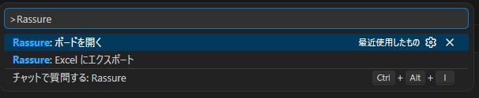
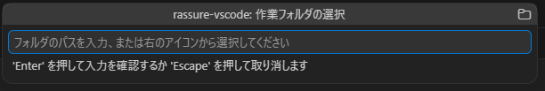
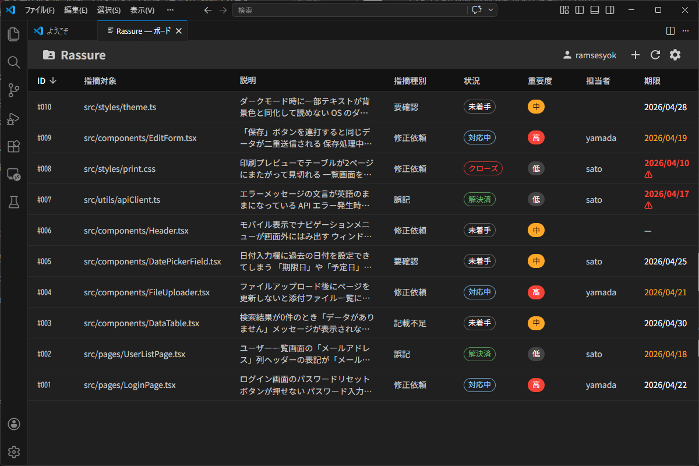
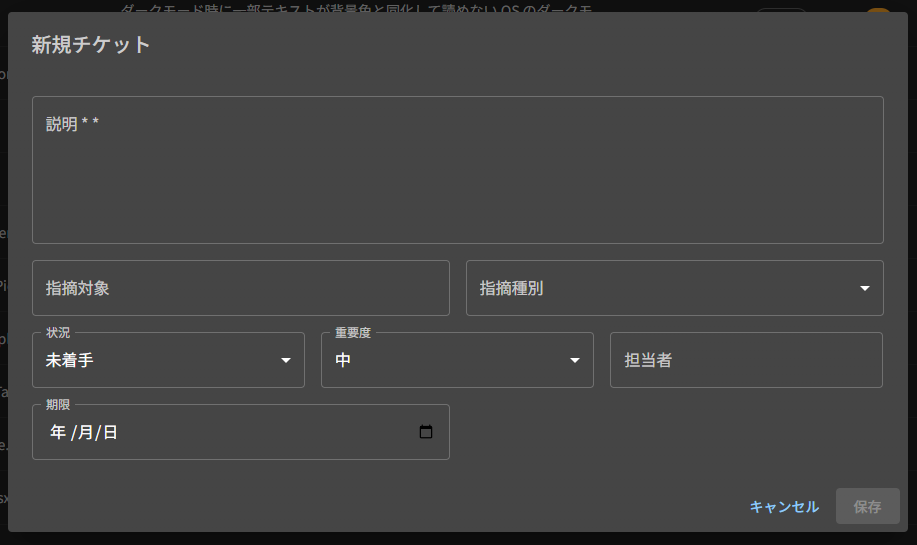
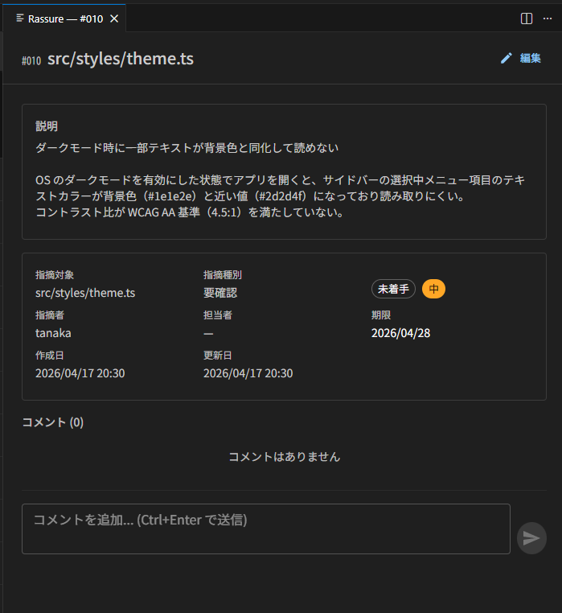
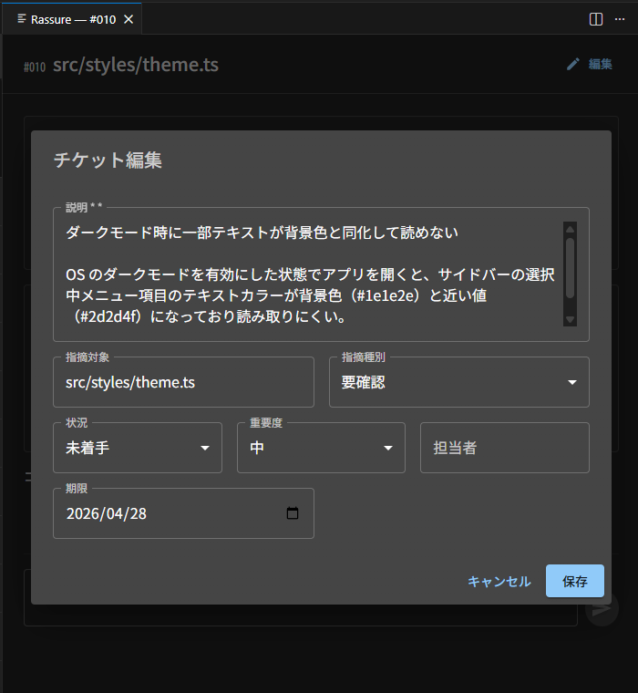
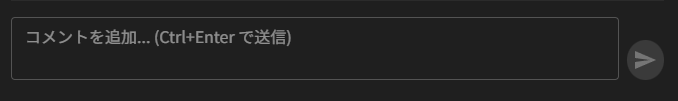
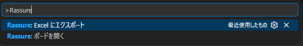
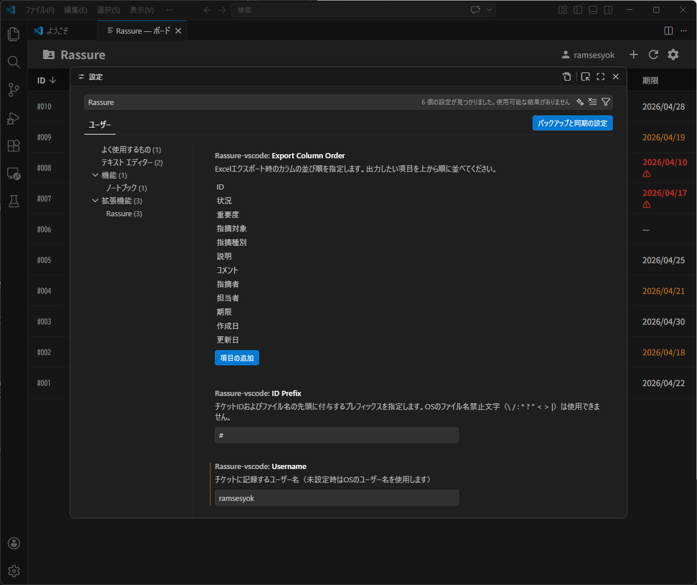

# Rassure for VS Code

A **serverless, fully offline** issue tracker for VS Code that stores tickets as JSON files in a local folder.  
No database or server required — works in closed network environments.

> [!WARNING]
> **This tool is designed for small teams.**  
> There is no file locking or exclusive access control. If multiple people edit the same ticket simultaneously, the last save wins and earlier changes will be lost.  
> When using a network shared folder, establish a team convention to **avoid editing the same ticket at the same time**.

**[日本語ドキュメント](docs/README.ja.md)**

---

## Table of Contents

1. [Installation](#installation)
2. [Getting Started — Setting the Storage Folder](#getting-started--setting-the-storage-folder)
3. [Board View](#board-view)
4. [Creating a Ticket](#creating-a-ticket)
5. [Ticket Detail & Edit](#ticket-detail--edit)
6. [Adding Comments](#adding-comments)
7. [Excel Export](#excel-export)
8. [Settings](#settings)
9. [Customizing Categories](#customizing-categories)
10. [Ticket Data Format](#ticket-data-format)
11. [Development & Build](#development--build)

---

## Installation

Search for **Rassure** in the VS Code Extensions Marketplace, or install manually from a `.vsix` file.

**Manual installation (offline environment):**

1. Obtain the `.vsix` file
2. Open the Command Palette (`Ctrl+Shift+P`) and run `Extensions: Install from VSIX...`
3. Select the file to install

---

## Getting Started — Setting the Storage Folder

First, set the folder where tickets will be stored.

Open the **Command Palette** (`Ctrl+Shift+P` / `Cmd+Shift+P`) and run:

```
Rassure: Open Board
```



The board opens with a folder selector at the top.



There are two ways to specify a folder:

| Method | Action |
|--------|--------|
| Type a path directly | Enter the path in the text box and press Enter |
| Browse with a dialog | Click the folder icon on the right |

The selected folder is remembered and pre-filled on subsequent uses.  
To change the folder, re-run the command or click the **Settings button** in the top-right of the board.

> Switching folders automatically closes any open detail panels.

---

## Board View

All tickets in the storage folder are displayed as a table.



### Columns

| Column | Description |
|--------|-------------|
| ID | Ticket number |
| Status | Open / In Progress / Resolved / Closed |
| Priority | High / Medium / Low |
| Target | Target file or screen name |
| Category | Issue category |
| Description | Beginning of the ticket body |
| Assignee | Person responsible |
| Due Date | Response deadline |

### Toolbar Buttons

| Button | Function |
|--------|----------|
| New | Create a new ticket |
| Excel | Export ticket list to .xlsx |
| Settings | Change the storage folder |

---

## Creating a Ticket

Click the **New button** in the top-right of the board to open the ticket creation form.



### Fields

| Field | Description | Required |
|-------|-------------|----------|
| Description | Issue content | ✓ |
| Target | Target file or screen name | |
| Category | Category (dropdown) | |
| Status | Open / In Progress / Resolved / Closed | |
| Priority | High / Medium / Low | |
| Assignee | Person responsible | |
| Due Date | Deadline (date picker) | |
| Reporter | Submitter name (defaults to the configured username) | |

Click **Save** to create the ticket as a JSON file in the storage folder.  
The ticket ID (e.g. `#001`) is assigned automatically.

---

## Ticket Detail & Edit

Click a row in the board to open the detail panel in a new tab.



Click the **Edit button** to make fields editable.



Click **Save** to apply changes, or **Cancel** to discard them.

---

## Adding Comments

The comment input is at the bottom of the detail panel.



Enter text and click the send button (or press `Ctrl+Enter`) to post a comment with a timestamp and author name.  
Comments are stored chronologically inside the ticket JSON file.

---

## Excel Export

Click the **Excel button** in the board toolbar, or use the Command Palette:

```
Rassure: Export to Excel
```



A save dialog appears — choose a filename and destination.

### Export Details

- Output uses Excel table format (`TableStyleMedium2`) so column filters and sorting are immediately available
- Multiple comments are combined into a single cell with text wrapping applied
- The board does not need to be open — tickets are read directly from the configured folder

### Exported Columns

| Column | Description |
|--------|-------------|
| ID | Ticket number |
| Status | Open / In Progress / Resolved / Closed |
| Priority | High / Medium / Low |
| Target | Target file or screen name |
| Category | Issue category |
| Description | Full ticket body |
| Comments | All comments joined chronologically |
| Reporter | Submitter name |
| Assignee | Person responsible |
| Due Date | Deadline |
| Created At | Creation timestamp |
| Updated At | Last update timestamp |

The column order and selection can be customized in VS Code settings ([see below](#excel-column-customization)).

---

## Settings

Open VS Code settings with `Ctrl+,` (`Cmd+,` on Mac) and search for **`Rassure`**.



| Setting Key | Default | Description |
|-------------|---------|-------------|
| `rassure-vscode.username` | (OS username) | Display name recorded on tickets |
| `rassure-vscode.idPrefix` | `#` | Prefix for ticket IDs and filenames |
| `rassure-vscode.exportColumnOrder` | All 12 columns | Column order and selection for Excel export |

### Ticket ID Prefix

Changing `rassure-vscode.idPrefix` affects **newly created tickets** only.

```
Example: changing idPrefix to "No."
  New ticket  → No.001.json (id: "No.001")
  Old tickets → #001.json — still loaded as-is
```

- Maximum 5 characters
- OS-reserved characters (`\ / : * ? " < > |`) are not allowed (the settings UI shows a validation error)
- Existing tickets are never deleted or renamed when the prefix changes

### Excel Column Customization

`rassure-vscode.exportColumnOrder` accepts an array that controls the column order and which columns are included.

- Reorder items to change the column order in the output
- Remove an item to exclude that column
- Available values: `ID` `状況` `重要度` `指摘対象` `指摘種別` `説明` `コメント` `指摘者` `担当者` `期限` `作成日` `更新日`

---

## Customizing Categories

Category dropdown options are configured via a `rassure.json` file (JSON with Comments format) in the ticket storage folder.

If the file does not exist, it is created automatically when the board opens with these defaults:

```json
{
  "categories": ["Typo", "Missing Info", "Needs Review", "Change Request", "Question"]
}
```

Edit `rassure.json` with any text editor to customize the list. Reload the board to apply changes.

> **Migrating from an older version:** If a `categories` plain-text file exists in the folder and `rassure.json` does not, the extension automatically converts it to `rassure.json` when the board is opened. No manual action is required.

---

## Ticket Data Format

Tickets are saved as files like `#001.json` in the storage folder (prefix is configurable).

```json
{
  "id": "#001",
  "description": "Typo in the login screen button label",
  "target": "login.tsx",
  "category": "Typo",
  "status": "open",
  "priority": "medium",
  "assignee": "alice",
  "dueDate": "2026-04-30",
  "reporter": "bob",
  "createdAt": "2026-04-12T09:00:00.000Z",
  "updatedAt": "2026-04-12T09:00:00.000Z",
  "comments": []
}
```

Plain JSON files can be shared via Git or a network folder.

### `status` values

| Value | Display |
|-------|---------|
| `open` | Open |
| `in_progress` | In Progress |
| `resolved` | Resolved |
| `closed` | Closed |

### `priority` values

| Value | Display |
|-------|---------|
| `high` | High |
| `medium` | Medium |
| `low` | Low |

---

## Development & Build

### Requirements

- Node.js 18+
- VS Code 1.85+

### Setup

```bash
npm install
npm run build
```

### Debug

Press `F5` in VS Code to launch an Extension Development Host.

### Build Scripts

| Command | Description |
|---------|-------------|
| `npm run compile` | Type-check Extension Host TypeScript |
| `npm run build:webview` | Bundle Webview (React + MUI via Vite) |
| `npm run build` | Run both of the above |
| `npm run watch` | Watch-compile Extension Host TypeScript |

### Packaging

```bash
npx vsce package
```

---

## License

MIT
